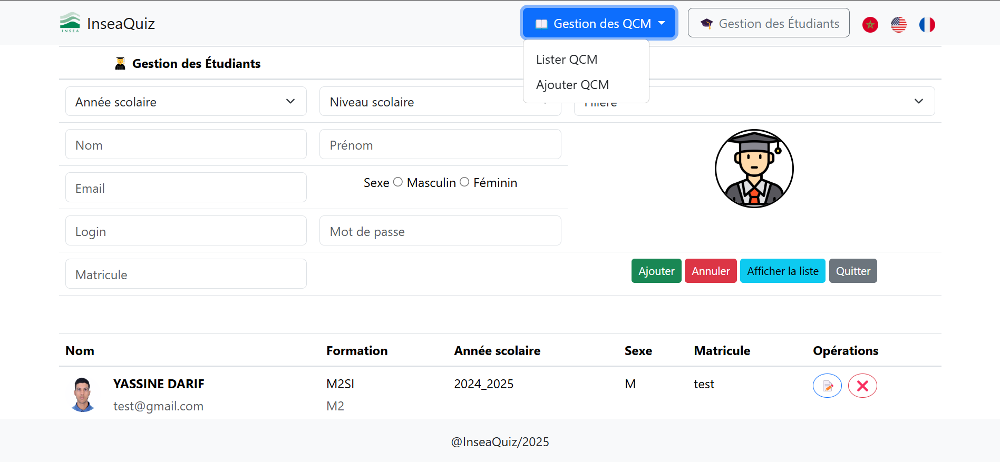

# 📝 Application Web de Gestion des QCM

Une application web développée en PHP permettant la gestion des QCM (Questionnaires à Choix Multiples). Elle est conçue pour deux types d’utilisateurs : **administrateur** et **étudiant**.

## 📌 Fonctionnalités

### 👨‍🏫 Administrateur

- Authentification sécurisée
- Gestion des étudiants (ajout, modification, suppression)
- Création et gestion des QCM
- Suivi des résultats des étudiants
- Interface de gestion conviviale

### 👨‍🎓 Étudiant

- Authentification
- Accès aux QCM disponibles
- Passage de QCM (avec minuterie si activée)
- Consultation des résultats et scores

## 🛠️ Technologies utilisées

- **Langage Backend** : PHP
- **Base de données** : MySQL
- **Frontend** : HTML5, CSS3, JavaScript, Bootstrap
- **Serveur local** : XAMPP
- **Autres outils** : Git, GitHub

## ✉️ Contact

Développé par :

- **Yassine Darif**  
  📧 [ydarif@insea.ac.ma](mailto:ydarif@insea.ac.ma)  
  🔗 [LinkedIn](www.linkedin.com/in/darif-yassine)

- **Younes Ouchake**  
  📧 [youchake@insea.ac.ma](mailto:youchake@insea.ac.ma)  
  🔗 [LinkedIn](https://www.linkedin.com/in/younes-ouchake-4b2502282/)
